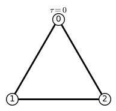

# Laplacian inertias of weighted signed graphs

Sample usage of functions:


```python
# load all functions

all_functions = ! ls | grep .sage
for function in all_functions:
    load(function)
```

### Create and plot a signed graph:
From a its weighted signed adjacency matrix


```python
A = matrix(([[ 0, 1,-7,-7],
             [ 1, 0, 1,-4],
             [-7, 1, 0, 1],
             [-7,-4, 1, 0]]))
[G,GP,GN] = signed_graph(A)
plot_signed_graph(G)
```


From the dict of its vertices and their incident positive and negative edges:


```python
pos = {1:[2], 3:[2,4]}
neg = {1:[3,4], 2:[4]}
[G,GP,GN] = signed_graph([pos,neg])
plot_signed_graph(G)
```


Evaluate the flexibility $\tau$, number of connected components $c$, and $c_\pm$:


```python
T = tau(G)
print('tau = %s\n\
c = %s\n\
c+ = %s\n\
c- = %s' %T)
```

    tau = 3
    c = 1
    c+ = 1
    c- = 1


### Build Laplacian matrices for the signed graph


```python
pos = {0:[1,4], 1:[2],2:[3],3:[4]}
neg = {0:[2,3],1:[3,4],2:[4]}

[X,G,SA,cfs,vars]= build_variables_laplacian(pos, neg, x='a') # x is the letter to be chosen as variable name
```

The Laplacian matrix with variables in its entries:


```python
show(X)
```


The plot of the signed graph:


```python
plot_signed_graph(G,figsize=[2,2])
```


The signed adjacency matrix:


```python
SA
```


    [ 0  1 -1 -1  1]
    [ 1  0  1 -1 -1]
    [-1  1  0  1 -1]
    [-1 -1  1  0  1]
    [ 1 -1 -1  1  0]


list of coefficients of the $M(\Gamma(t))$


```python
for c in cfs:
    show(c)
    print('')
```


    


This is not particularly useful as it is, but we can load some weights on it:


```python
var('t')
W = matrix([[0,0,0,0,0],
            [1,0,0,0,0],
            [2,1,0,0,0],
            [2,2,1,0,0],
            [1,2,2,1,0]])
w = matrix_weights_to_vector(W)
L = matrix(ZZ,X(w).apply_map(lambda x: real(x)))
```

Here is the Laplacian matrix with that particular weights on the edges:


```python
L
```


    [ 2  1 -2 -2  1]
    [ 1  2  1 -2 -2]
    [-2  1  2  1 -2]
    [-2 -2  1  2  1]
    [ 1 -2 -2  1  2]


And here are the coefficinets of $M(\Gamma(t))$ for the particular weights:


```python
for i,c in enumerate(cfs):
    print('coefficient of t^%s: %s' %(i,c(w)))
```

    coefficient of t^0: 5.00000000000000
    coefficient of t^1: -60.0000000000000
    coefficient of t^2: 220.000000000000
    coefficient of t^3: -240.000000000000
    coefficient of t^4: 80.0000000000000


### Some operations on graphs

$G \cdot H$


```python
[G,GP,GN] = signed_graph(matrix(([[0,1,-7,-7],
                [1,0,1,-4],
                [-7,1,0,1],
                [-7,-4,1,0]])))
[H,HP,HN] = signed_graph(matrix(([[0,-1,-1],
                [-1,0,1],
                [-1,1,0]])))
GH = graph_dot(G,H,0,2)
plot_signed_graph(GH,figsize=[2,2])
```


```python
[G,GP,GN] = signed_graph(matrix(([[0,1,-7,-7],
                [1,0,1,-4],
                [-7,1,0,1],
                [-7,-4,1,0]])))
GH = [copy(G)]
for i in range(4):
    GH += [graph_dot(copy(GH[-1]),copy(G))]
    plot_signed_graph(GH[-2],figsize=[2,2]).show()
```


$K_m \vee^- K_n$


```python
m = 3
n = 3
G = bicomplete_wedge_minus(m,n)
plot_signed_graph(G)
```


### Evaluating $M(\Gamma(t))$

With all weights: $\pm 1$


```python
M = emm_of_gamma_of_tee(G)
show(M)
```


<html><script type="math/tex; mode=display">\newcommand{\Bold}[1]{\mathbf{#1}}-81 \, {\left(t - 1\right)}^{4} t</script></html>


With a given weighting:


```python
M = emm_of_gamma_of_tee(L)
show(M)
```


<html><script type="math/tex; mode=display">\newcommand{\Bold}[1]{\mathbf{#1}}5 \, {\left(4 \, t^{2} - 6 \, t + 1\right)}^{2}</script></html>


### All signed graph on $n$ vertices and their flexibilities
(Up to isomorphism)


```python
n = 3
all_signed_graphs_with_tau(n,figsize=[2,2])
```





### All possible signings of the edges of a graph and their flexibilities
(Up to isomorphism)


```python
n = 4
G = graphs.CompleteGraph(n)
sign_with_tau(G,figsize=[2,2])
```

    The following signings of the graph have tau = 0


    The following signings of the graph have tau = 1


    The following signings of the graph have tau = 2


    The following signings of the graph have tau = 3


